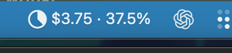
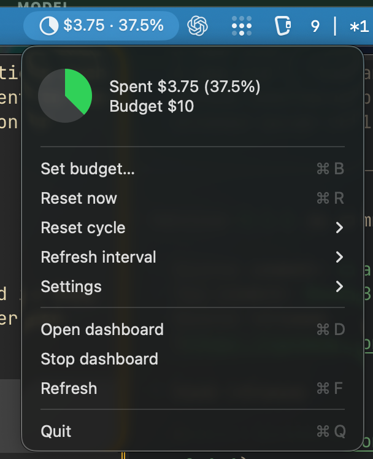
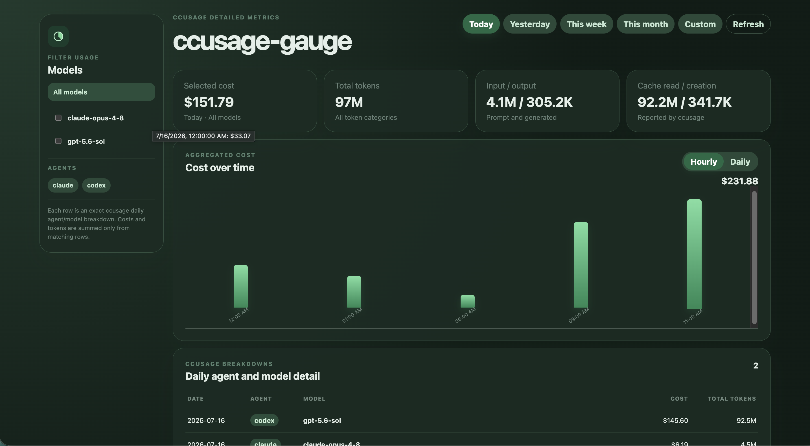

# ccusage-gauge

A macOS menu-bar cost gauge and local dashboard backed exclusively by
`ccusage --json`.

The status item shows a budget-progress pie followed by cost in the selected
aggregation period. Its menu supports budget editing, hourly/daily/weekly/
monthly/custom-hour aggregation periods, Launch at Login, dashboard start/stop/open,
refresh, and quit. Missing or invalid `ccusage` configuration changes the
status icon to a warning and exposes diagnostics plus retry in an Error Details
submenu.

## Screenshots

### Menu bar

The compact status item shows current spend and budget usage at a glance.

<p align="center">
  
</p>

The expanded menu provides budget, aggregation-period, refresh-interval, settings,
and dashboard controls.

<p align="center">
  
</p>

### Dashboard



The SolidJS dashboard provides:

- exact per-agent and per-model rows from `ccusage daily --json --by-agent`;
- left-side model and agent filters;
- top-right Today, Yesterday, This week, This month, and Custom date controls;
- cost-over-time graph with Hourly (default) and Daily aggregation;
- selected-period cost/token totals and detailed agent/model rows;
- budget and aggregation-period summaries from the same AppCore snapshot.

## Development

```bash
nix develop
task build
task test
task app:build
task app:run
swift run ccusage-gauge --help
swift run ccusage-gauge-menubar
```

`task app:build` creates an ad-hoc signed `.build/CCUsageGauge.app` bundle with
`Resources/AppIcon.icns`. `task app:run` builds and launches that menu-bar app.
Because it is an `LSUIElement` utility, it uses the icon in Finder and launch
surfaces but intentionally does not remain in the Dock.

The package uses Swift Package Manager with:

- Library target: `AppCore`
- Executable target: `AppCLI`
- Installed executable: `ccusage-gauge`
- Menu-bar executable target/product: `CCUsageGaugeMenuBar` / `ccusage-gauge-menubar`

Swift target names and type names must be valid Swift identifiers. If the project
name contains hyphens, keep `PROJECT_NAME` and `EXECUTABLE_NAME` hyphenated as
needed, but use identifier-safe values such as `AppCore`, `AppCLI`, and
`AppCommand` for Swift module/type variables.

## Configuration and state

Static configuration is created once at
`~/.config/ccusage-gauge/ccusage-config.json`. It is safe to manage this file
read-only with Nix after creation. The application does not rewrite an existing
configuration file, including one managed by Nix.

The generated defaults are:

```json
{
  "ccusagePath": null,
  "defaultResetTerm": "daily",
  "dashboardPort": 18081,
  "dashboardAutostart": true,
  "pollIntervalSeconds": 20
}
```

| Field | Type and default | Behavior and validation |
| --- | --- | --- |
| `ccusagePath` | string or `null`; default `null` | An explicit value must be an absolute executable path. `null` searches `PATH`, `/opt/homebrew/bin`, and `/usr/local/bin`. An invalid explicit path is an error and does not fall back. |
| `defaultResetTerm` | string; default `"daily"` | Initial aggregation period when mutable state has no selection. Supported values are `"hourly"`, `"daily"`, `"weekly"`, and `"monthly"`. |
| `dashboardPort` | integer; default `18081` | Loopback port in the range `1` through `65535`. The dashboard binds to `127.0.0.1`, and **Open dashboard** opens `http://127.0.0.1:<dashboardPort>/`. |
| `dashboardAutostart` | boolean; default `true` | Starts the local dashboard server when the menu-bar application starts. |
| `pollIntervalSeconds` | integer; default `20` | Usage refresh interval in seconds. It must be positive. |

Configuration is loaded when the application starts. After changing any field,
quit and relaunch `ccusage-gauge`; the menu's **Refresh** action refreshes usage
data but does not reload configuration. For example, to use port `19090`, set
`"dashboardPort": 19090`, relaunch the application, and choose **Open
dashboard** to open `http://127.0.0.1:19090/`.

Validate the production configuration and resolved `ccusage` executable with:

```bash
ccusage-gauge config-check
```

During source development, the equivalent command is:

```bash
swift run ccusage-gauge config-check
```

Mutable budget/aggregation-period state is stored separately at
`~/.local/ccusage-gauge/state.json` with user-only permissions. Menu actions do
not rewrite the static configuration. The **Refresh interval** submenu can set
a persistent positive whole-number override in seconds or return to the
`pollIntervalSeconds` configuration default.

## E2E testing

Build an isolated app bundle with a deterministic `ccusage` fixture:

```bash
task e2e:build -- fixture
```

The Computer Use scenarios and recorded evidence are under
`design-docs/e2e/`. E2E config and state stay below `.build/e2e` and do not touch
the operator's production files.

## Homebrew Formula

Build local formula archives:

```bash
task build:homebrew -- darwin-arm64 darwin-x64
```

Render a formula after both platform archives exist:

```bash
task homebrew:formula -- 0.1.2
```

Render directly into the default sibling tap checkout:

```bash
task homebrew:tap-formula -- 0.1.2
```

Install from the tap after the formula is published:

```bash
brew tap tacogips/tap
brew install ccusage-gauge
```

## Homebrew Cask

The Cask workflow builds signed, notarized, and stapled macOS app archives with
the project icon for Apple Silicon and Intel Macs. Release assets are hosted in
the shared `tacogips/homebrew-tap` repository, following `bifrost-gauge`.
Apple signing credentials must stay local and must not be committed.

Check the build plan:

```bash
task build:homebrew-cask -- --dry-run darwin-arm64 darwin-x64
```

Build with local signing credentials:

```bash
kinko exec --env APPLE_SIGNING_IDENTITY,APPLE_ID,APPLE_PASSWORD,APPLE_TEAM_ID -- \
  task build:homebrew-cask -- darwin-arm64 darwin-x64
```

Render a Cask:

```bash
task homebrew:cask -- 0.1.2
```

For a tagged release, build, upload, and render the tap Cask:

```bash
kinko exec --env APPLE_SIGNING_IDENTITY,APPLE_ID,APPLE_PASSWORD,APPLE_TEAM_ID -- \
  task release:homebrew-cask-local -- v0.1.2
```

See `packaging/homebrew/README.md` and `.agents/skills/` for release workflows.

## License

This project is available under the [MIT License](LICENSE).
