# Multi-machine Docker validation captures

These captures were taken from the live Docker emulation with `machine-a` and
`machine-b` registered as independent SSH machines. The sequence demonstrates
aggregate display, filters, machine lifecycle state, and recovery.

1. Responsive filter layout with all three machine scopes visible:
   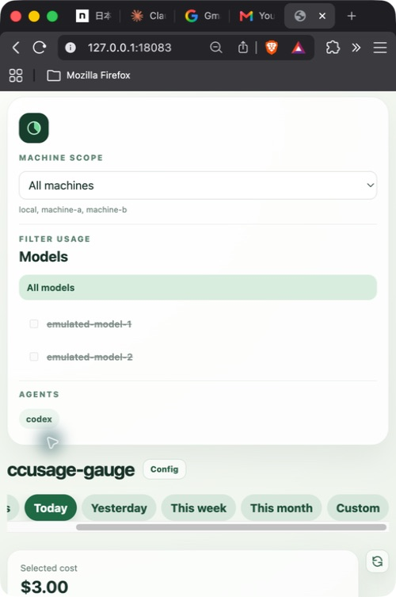
2. Daily aggregate stacked by model:
   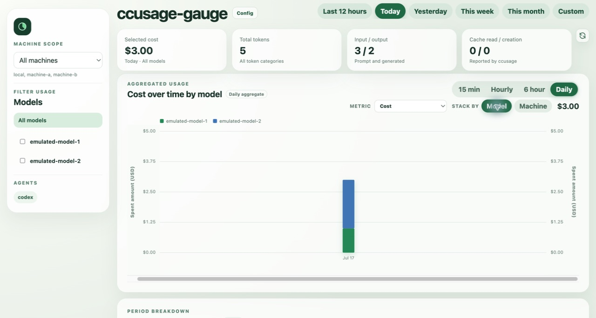
3. Daily aggregate stacked by machine:
   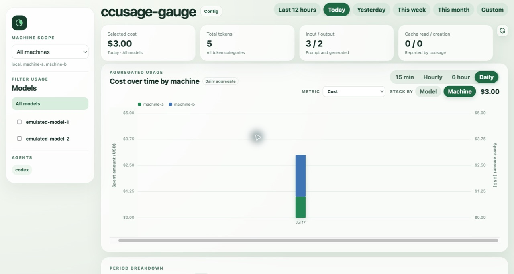
4. Per-host/per-model breakdowns and machine-attributed table rows:
   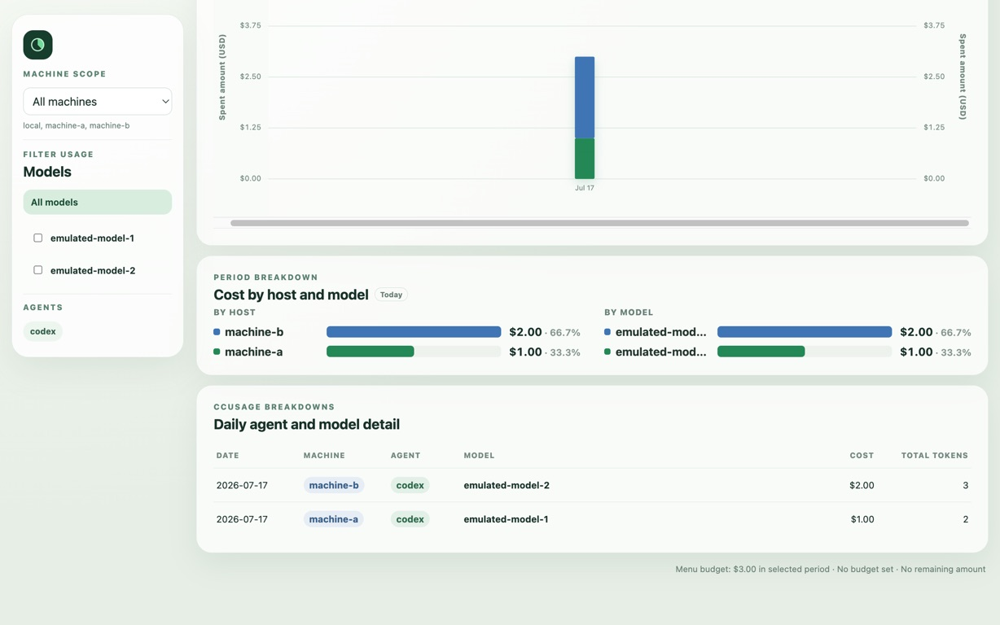
5. `machine-a` filter, showing only its model and totals:
   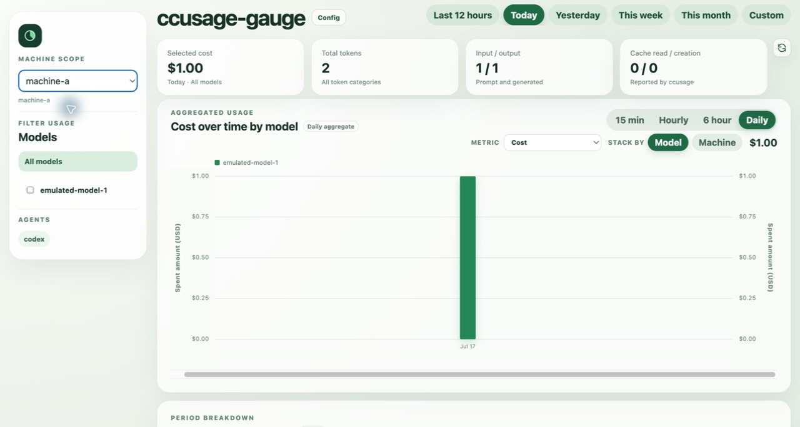
6. `machine-b` filter, showing only its model and totals:
   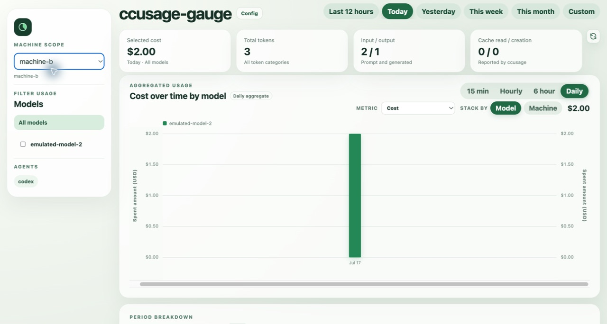
7. Local-only filter, showing the expected empty local scope:
   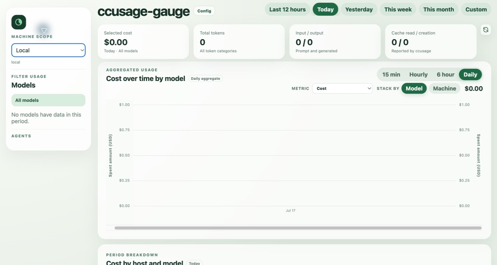
8. Model filter for `emulated-model-1`:
   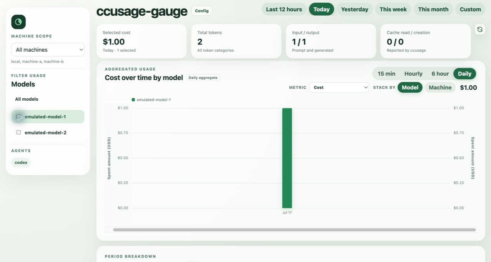
9. Codex agent filter with both matching models selected:
   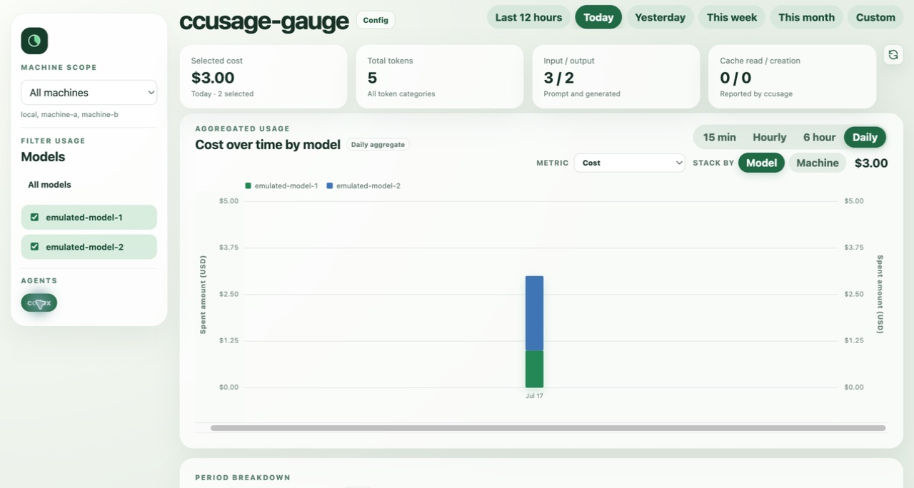
10. Machine configuration with both Docker remotes healthy:
    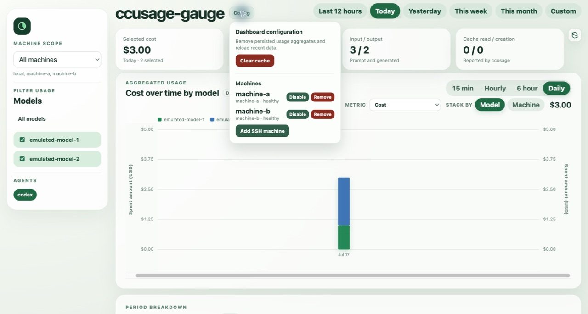
11. Partial availability after stopping `machine-b`; cached aggregate data stays
    visible while the stale machine is identified:
    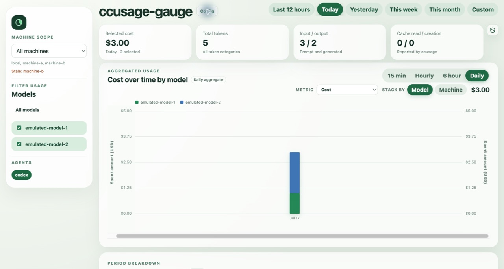
12. Recovered aggregate after restarting and refreshing `machine-b`:
    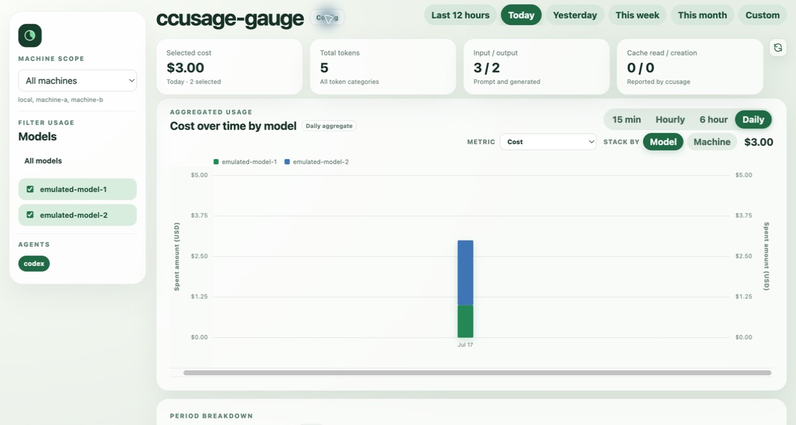
